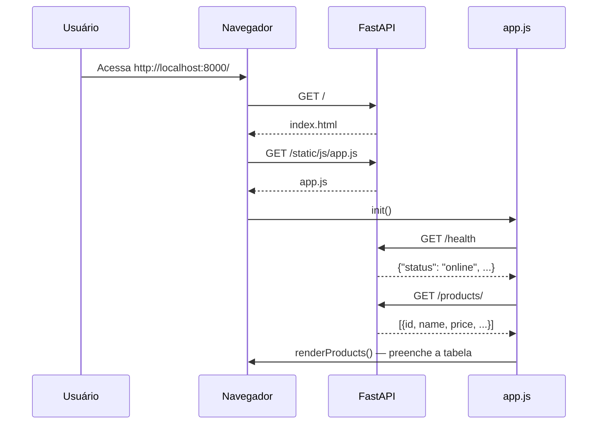
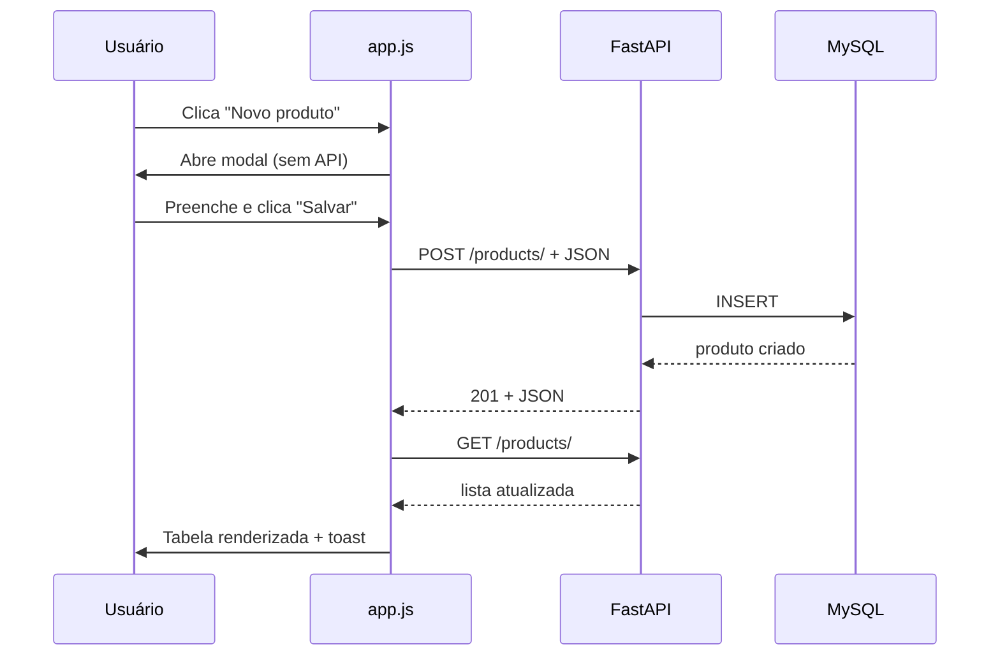

# Frontend e Chamadas aos Endpoints

Material didático sobre a interação entre o **navegador** (HTML + JavaScript) e a **API FastAPI**, desde o carregamento inicial da página até cada operação CRUD.

---

## 1. Visão geral da arquitetura

O frontend **não acessa o MySQL diretamente**. Ele consome a API REST via HTTP (função `fetch` do JavaScript).

```
┌──────────────┐    HTML/CSS/JS     ┌──────────────┐    JSON/HTTP    ┌──────────────┐
│  Navegador   │ ◄───────────────► │   FastAPI    │ ◄─────────────► │    MySQL     │
│              │   fetch()          │  /products/  │   SQLAlchemy    │              │
└──────────────┘                    └──────────────┘                 └──────────────┘
```

| Camada | Arquivo | Responsabilidade |
|--------|---------|------------------|
| HTML | `app/templates/index.html` | Estrutura da página (botões, tabela, modais) |
| CSS | `app/static/css/style.css` | Aparência visual |
| JavaScript | `app/static/js/app.js` | Eventos do usuário + chamadas à API |
| API | `app/controllers/product_controller.py` | Endpoints REST |
| Página inicial | `app/controllers/frontend_controller.py` | Serve o HTML em `/` |

---

## 2. Carregamento inicial da página

### Passo 1 — Usuário acessa `http://localhost:8000/`

O navegador faz uma requisição **GET /**. O FastAPI responde com o HTML:

```12:15:app/controllers/frontend_controller.py
@router.get("/", response_class=HTMLResponse)
def index(request: Request):
    """View (V do MVC): interface web do CRUD."""
    return templates.TemplateResponse(request, "index.html")
```

### Passo 2 — Navegador carrega CSS e JavaScript

No final do HTML, o script é incluído:

```151:151:app/templates/index.html
  <script src="/static/js/app.js"></script>
```

Assim que `app.js` é carregado, a função `init()` roda automaticamente:

```284:290:app/static/js/app.js
async function init() {
  bindEvents();
  await checkHealth();
  await loadProducts();
}

init();
```

### Passo 3 — O que `init()` faz

| Ordem | Função | Ação |
|-------|--------|------|
| 1 | `bindEvents()` | Conecta cliques e formulários aos handlers |
| 2 | `checkHealth()` | Chama `GET /health` — verifica se a API está online |
| 3 | `loadProducts()` | Chama `GET /products/` — carrega a lista na tabela |



---

## 3. Configuração das URLs da API

No início de `app.js`, as rotas da API são centralizadas:

```1:4:app/static/js/app.js
const API = {
  products: "/products/",
  health: "/health",
};
```

Como frontend e API estão no **mesmo domínio** (`localhost:8000`), usamos caminhos relativos — não é necessário CORS.

---

## 4. Função central: `apiRequest()`

Todas as chamadas à API passam por esta função, que encapsula o `fetch`:

```59:81:app/static/js/app.js
async function apiRequest(url, options = {}) {
  const response = await fetch(url, {
    headers: { "Content-Type": "application/json", ...options.headers },
    ...options,
  });

  if (!response.ok) {
    let detail = "Erro na requisição.";
    try {
      const data = await response.json();
      detail = data.detail || detail;
      if (Array.isArray(detail)) {
        detail = detail.map((e) => e.msg).join(", ");
      }
    } catch {
      /* resposta sem JSON */
    }
    throw new Error(detail);
  }

  if (response.status === 204) return null;
  return response.json();
}
```

| Parte | Função |
|-------|--------|
| `fetch(url, options)` | API nativa do navegador para requisições HTTP |
| `Content-Type: application/json` | Informa que o corpo é JSON |
| `response.ok` | `false` se status ≥ 400 (erro) |
| `response.status === 204` | DELETE bem-sucedido — sem corpo JSON |
| `response.json()` | Converte a resposta em objeto JavaScript |

---

## 5. Mapeamento: ação do usuário → endpoint

| Ação do usuário | Função JS | Método | Endpoint | Backend |
|-----------------|-----------|--------|----------|---------|
| Página carrega | `checkHealth()` | GET | `/health` | `health_check()` |
| Página carrega / Atualizar | `loadProducts()` | GET | `/products/` | `list_products()` |
| Novo produto → Salvar | `handleSubmit()` | POST | `/products/` | `create_product()` |
| Editar → Salvar | `handleSubmit()` | PUT | `/products/{id}` | `update_product()` |
| Excluir → Confirmar | `handleDelete()` | DELETE | `/products/{id}` | `delete_product()` |

> **Nota:** O frontend usa **PUT** na edição. O endpoint **PATCH** existe na API, mas não é usado pelo `app.js` — poderia ser adicionado para atualizações parciais.

---

## 6. Fluxo detalhado: verificar status da API

### HTML — indicador na sidebar

```27:30:app/templates/index.html
      <div class="sidebar-footer">
        <span class="status-dot" id="api-status"></span>
        <span id="api-status-text">Verificando API...</span>
      </div>
```

### JavaScript — chamada ao endpoint

```158:167:app/static/js/app.js
async function checkHealth() {
  try {
    const data = await apiRequest(API.health);
    els.apiStatus.className = "status-dot online";
    els.apiStatusText.textContent = data.message || "API online";
  } catch {
    els.apiStatus.className = "status-dot offline";
    els.apiStatusText.textContent = "API offline";
  }
}
```

### Backend — resposta

```35:42:app/main.py
@app.get("/health", tags=["Saúde"])
def health_check():
    return {
        "status": "online",
        "message": "API CRUD funcionando!",
        "frontend": "/",
        "docs": "/docs",
    }
```

**Fluxo:** `init()` → `checkHealth()` → `GET /health` → atualiza o ponto verde/vermelho na sidebar.

---

## 7. Fluxo detalhado: listar produtos (READ)

### HTML — corpo da tabela

```81:85:app/templates/index.html
            <tbody id="products-body">
              <tr class="loading-row">
                <td colspan="7">Carregando produtos...</td>
              </tr>
            </tbody>
```

### JavaScript — requisição e renderização

```147:156:app/static/js/app.js
async function loadProducts() {
  els.body.innerHTML = `<tr class="loading-row"><td colspan="7">Carregando produtos...</td></tr>`;
  try {
    products = await apiRequest(API.products);
    renderProducts();
  } catch (err) {
    els.body.innerHTML = `<tr class="loading-row"><td colspan="7">Erro ao carregar: ${escapeHtml(err.message)}</td></tr>`;
    showToast(err.message, "error");
  }
}
```

Equivalente HTTP:

```http
GET /products/ HTTP/1.1
Host: localhost:8000
```

Resposta JSON (exemplo):

```json
[
  {
    "id": 1,
    "name": "Teclado",
    "description": "Mecânico RGB",
    "price": "299.90",
    "quantity": 10,
    "created_at": "2026-06-26T08:09:09",
    "updated_at": "2026-06-26T08:09:09"
  }
]
```

A função `renderProducts()` monta as linhas da tabela em HTML e adiciona botões **Editar** e **Excluir** com `data-id`:

```120:138:app/static/js/app.js
  els.body.innerHTML = list
    .map(
      (p) => `
    <tr data-id="${p.id}">
      ...
          <button type="button" class="btn btn-ghost btn-sm btn-edit" data-id="${p.id}">Editar</button>
          <button type="button" class="btn btn-danger btn-sm btn-delete" data-id="${p.id}">Excluir</button>
      ...
    </tr>`
    )
    .join("");
```

### Backend

```11:14:app/controllers/product_controller.py
@router.get("/", response_model=list[ProductResponse])
def list_products(db: Session = Depends(get_db)):
    """Controller (C do MVC): lista todos os produtos."""
    return ProductService.get_all(db)
```

---

## 8. Fluxo detalhado: criar produto (CREATE)

### Passo 1 — Usuário clica em "Novo produto"

```39:42:app/templates/index.html
        <button type="button" class="btn btn-primary" id="btn-new">
          <span class="btn-icon">+</span>
          Novo produto
        </button>
```

Evento registrado em `bindEvents()`:

```265:265:app/static/js/app.js
  $("#btn-new").addEventListener("click", openCreateModal);
```

`openCreateModal()` abre o modal vazio — **ainda não chama a API**.

### Passo 2 — Usuário preenche o formulário e clica "Salvar"

O formulário dispara `handleSubmit`:

```273:273:app/static/js/app.js
  els.form.addEventListener("submit", handleSubmit);
```

### Passo 3 — JavaScript monta o JSON e faz POST

```209:241:app/static/js/app.js
async function handleSubmit(event) {
  event.preventDefault();

  const payload = {
    name: els.productName.value.trim(),
    description: els.productDescription.value.trim() || null,
    price: parseFloat(els.productPrice.value),
    quantity: parseInt(els.productQuantity.value, 10),
  };

  const id = els.productId.value;

  try {
    ...
    if (id) {
      await apiRequest(`${API.products}${id}`, {
        method: "PUT",
        body: JSON.stringify(payload),
      });
      ...
    } else {
      await apiRequest(API.products, {
        method: "POST",
        body: JSON.stringify(payload),
      });
      showToast("Produto criado com sucesso!");
    }

    closeModal();
    await loadProducts();
```

Quando `product-id` está vazio → **criação** → `POST /products/`:

```http
POST /products/ HTTP/1.1
Content-Type: application/json

{
  "name": "Mouse",
  "description": "Sem fio",
  "price": 89.90,
  "quantity": 50
}
```

### Passo 4 — Backend processa e responde

```28:30:app/controllers/product_controller.py
@router.post("/", response_model=ProductResponse, status_code=status.HTTP_201_CREATED)
def create_product(product_data: ProductCreate, db: Session = Depends(get_db)):
    return ProductService.create(db, product_data)
```

### Passo 5 — Frontend recarrega a lista

Após sucesso, `await loadProducts()` chama `GET /products/` novamente para atualizar a tabela.



---

## 9. Fluxo detalhado: editar produto (UPDATE)

### Passo 1 — Usuário clica "Editar" na tabela

O clique é capturado por delegação de eventos no `tbody`:

```276:281:app/static/js/app.js
  els.body.addEventListener("click", (e) => {
    const editBtn = e.target.closest(".btn-edit");
    const deleteBtn = e.target.closest(".btn-delete");
    if (editBtn) openEditModal(Number(editBtn.dataset.id));
    if (deleteBtn) openDeleteModal(Number(deleteBtn.dataset.id));
  });
```

### Passo 2 — Modal preenchido com dados locais

`openEditModal(id)` busca o produto no array `products` (já carregado) — **sem nova chamada GET /products/{id}**:

```177:188:app/static/js/app.js
function openEditModal(id) {
  const product = products.find((p) => p.id === id);
  if (!product) return;

  els.modalTitle.textContent = "Editar produto";
  els.productId.value = product.id;
  els.productName.value = product.name;
  ...
  els.modal.showModal();
}
```

### Passo 3 — Salvar envia PUT

Como `product-id` tem valor, `handleSubmit` usa **PUT**:

```226:230:app/static/js/app.js
    if (id) {
      await apiRequest(`${API.products}${id}`, {
        method: "PUT",
        body: JSON.stringify(payload),
      });
```

```http
PUT /products/1 HTTP/1.1
Content-Type: application/json

{
  "name": "Teclado",
  "description": "Mecânico RGB",
  "price": 279.90,
  "quantity": 20
}
```

### Backend

```33:44:app/controllers/product_controller.py
@router.put("/{product_id}", response_model=ProductResponse)
def update_product(
    product_id: int, product_data: ProductUpdate, db: Session = Depends(get_db)
):
    ...
    return ProductService.update(db, product, product_data)
```

---

## 10. Fluxo detalhado: excluir produto (DELETE)

### Passo 1 — Clique em "Excluir"

Abre modal de confirmação (sem API ainda):

```195:201:app/static/js/app.js
function openDeleteModal(id) {
  const product = products.find((p) => p.id === id);
  if (!product) return;

  deleteTargetId = id;
  els.deleteProductName.textContent = product.name;
  els.deleteModal.showModal();
}
```

### Passo 2 — Confirmação chama DELETE

```251:261:app/static/js/app.js
async function handleDelete() {
  if (!deleteTargetId) return;

  try {
    await apiRequest(`${API.products}${deleteTargetId}`, { method: "DELETE" });
    showToast("Produto excluído com sucesso!");
    closeDeleteModal();
    await loadProducts();
  } catch (err) {
    showToast(err.message, "error");
  }
}
```

```http
DELETE /products/1 HTTP/1.1
```

Resposta: **204 No Content** (sem JSON). Por isso `apiRequest` retorna `null`:

```79:80:app/static/js/app.js
  if (response.status === 204) return null;
  return response.json();
```

---

## 11. Registro de eventos (`bindEvents`)

Todos os gatilhos do usuário são conectados em um único lugar:

```264:282:app/static/js/app.js
function bindEvents() {
  $("#btn-new").addEventListener("click", openCreateModal);
  $("#btn-refresh").addEventListener("click", loadProducts);
  $("#btn-close-modal").addEventListener("click", closeModal);
  $("#btn-cancel").addEventListener("click", closeModal);
  $("#btn-close-delete").addEventListener("click", closeDeleteModal);
  $("#btn-cancel-delete").addEventListener("click", closeDeleteModal);
  $("#btn-confirm-delete").addEventListener("click", handleDelete);

  els.form.addEventListener("submit", handleSubmit);
  els.search.addEventListener("input", renderProducts);

  els.body.addEventListener("click", (e) => {
    const editBtn = e.target.closest(".btn-edit");
    const deleteBtn = e.target.closest(".btn-delete");
    if (editBtn) openEditModal(Number(editBtn.dataset.id));
    if (deleteBtn) openDeleteModal(Number(deleteBtn.dataset.id));
  });
}
```

| Elemento HTML | ID / classe | Evento | Chama API? |
|---------------|-------------|--------|------------|
| Novo produto | `#btn-new` | click | Não (abre modal) |
| Atualizar | `#btn-refresh` | click | Sim → GET `/products/` |
| Salvar formulário | `#product-form` | submit | Sim → POST ou PUT |
| Excluir confirmar | `#btn-confirm-delete` | click | Sim → DELETE |
| Busca | `#search-input` | input | Não (filtra array local) |
| Editar / Excluir | `.btn-edit`, `.btn-delete` | click | Não (abre modal) |

A **busca** filtra o array `products` em memória — não faz requisição ao servidor.

---

## 12. Referência de elementos HTML (`els`)

O JavaScript mapeia IDs do HTML para variáveis reutilizáveis:

```9:32:app/static/js/app.js
const $ = (sel) => document.querySelector(sel);

const els = {
  body: $("#products-body"),
  empty: $("#empty-state"),
  ...
  productName: $("#product-name"),
  ...
};
```

O atalho `$()` é equivalente a `document.querySelector()` — busca um elemento pelo seletor CSS.

---

## 13. Tratamento de erros no frontend

Se a API retornar erro (404, 422, 500), `apiRequest` lança exceção com a mensagem do backend:

```65:76:app/static/js/app.js
  if (!response.ok) {
    let detail = "Erro na requisição.";
    try {
      const data = await response.json();
      detail = data.detail || detail;
      ...
    }
    throw new Error(detail);
  }
```

As funções `loadProducts`, `handleSubmit` e `handleDelete` capturam o erro e exibem um **toast** vermelho via `showToast(err.message, "error")`.

---

## 14. Diagrama completo — do clique ao banco

```
Usuário clica "Salvar"
        │
        ▼
handleSubmit() ── monta payload JSON
        │
        ▼
apiRequest("/products/", { method: "POST", body: ... })
        │
        ▼
fetch() ── HTTP POST ──► FastAPI product_controller.create_product()
        │                        │
        │                        ▼
        │                 ProductService.create()
        │                        │
        │                        ▼
        │                      MySQL INSERT
        │                        │
        ◄── 201 JSON ◄───────────┘
        │
        ▼
loadProducts() ── GET /products/ ──► renderProducts() ──► tabela atualizada
```

---

## 15. Exercícios sugeridos

1. Abra o DevTools (F12) → aba **Network** e observe as requisições ao criar um produto.
2. Altere `handleSubmit` para usar **PATCH** em vez de PUT na edição.
3. Adicione botão que chame `GET /products/{id}` antes de abrir o modal de edição.
4. Implemente atualização parcial: editar só o preço sem enviar os outros campos.
5. Exiba no console o JSON retornado por cada `apiRequest`.

---

## 16. Documentos relacionados

- [SISTEMA.md](SISTEMA.md) — arquitetura MVC completa
- [FASTAPI.md](FASTAPI.md) — como os endpoints são implementados no backend
- [EXECUTAR_DOCKER.md](EXECUTAR_DOCKER.md) — como subir a aplicação
