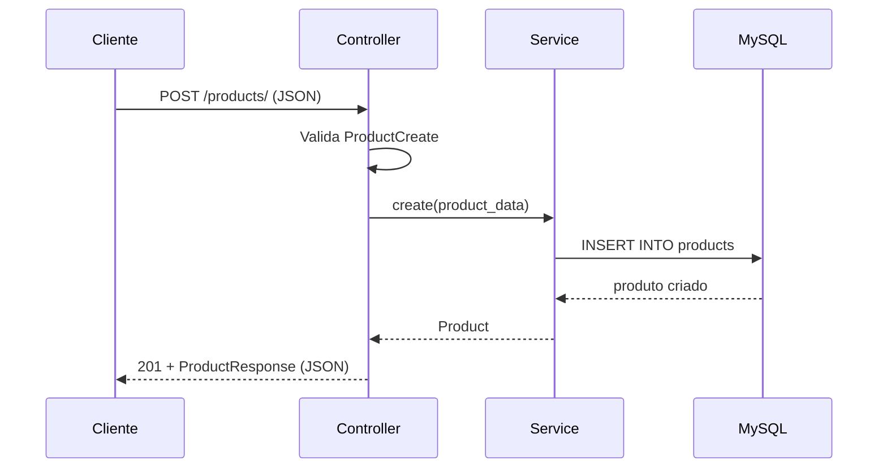

# Como o Sistema Funciona

Este documento explica, de forma didática, a arquitetura e o fluxo do sistema CRUD de Produtos.

---

## 1. Visão Geral

O projeto é uma **API REST** que permite gerenciar produtos (Create, Read, Update, Delete — CRUD) usando:

| Tecnologia | Função |
|------------|--------|
| **Python** | Linguagem de programação |
| **FastAPI** | Framework web para criar a API |
| **MySQL** | Banco de dados relacional |
| **SQLAlchemy** | ORM — mapeia tabelas Python ↔ MySQL |
| **Pydantic** | Validação e serialização de dados JSON |
| **Docker** | Empacota e executa tudo em containers |

---

## 2. Arquitetura MVC

**MVC** significa **Model – View – Controller** (Modelo – Visão – Controlador). É um padrão que separa responsabilidades:

```
┌─────────────┐     HTTP Request      ┌──────────────────┐
│   Cliente   │ ────────────────────► │   Controller     │
│ (navegador, │                       │ (product_controller)│
│  Postman)   │ ◄──────────────────── │                  │
└─────────────┘     JSON Response     └────────┬─────────┘
                                               │
                                    chama      ▼
                                    ┌──────────────────┐
                                    │    Service       │
                                    │ (product_service)│
                                    └────────┬─────────┘
                                             │
                              acessa         ▼
                              ┌──────────────────┐     ┌─────────────┐
                              │     Model        │ ◄──►│   MySQL     │
                              │  (Product ORM)   │     │  (products) │
                              └──────────────────┘     └─────────────┘

                              View = Schemas Pydantic (ProductResponse)
                              formatam o JSON de resposta
```

### Model (Modelo) — `app/models/`

Representa os **dados** e a estrutura da tabela no banco.

```python
# app/models/product.py
class Product(Base):
    __tablename__ = "products"
    id = ...
    name = ...
    price = ...
```

### View (Visão) — `app/schemas/`

Define **como os dados aparecem** na API (JSON de entrada e saída).

```python
# app/schemas/product.py
class ProductResponse(BaseModel):
    id: int
    name: str
    price: Decimal
    ...
```

### Controller (Controlador) — `app/controllers/`

Recebe requisições HTTP, valida entrada e devolve respostas.

```python
# app/controllers/product_controller.py
@router.post("/")
def create_product(product_data: ProductCreate, db: Session = Depends(get_db)):
    return ProductService.create(db, product_data)
```

### Service (Serviço) — `app/services/`

Camada extra com **regras de negócio** e operações no banco, mantendo o controller enxuto.

---

## 3. Estrutura de Pastas

```
app/
├── main.py                 # Ponto de entrada da API
├── config.py               # Variáveis de ambiente
├── database.py             # Conexão com MySQL
├── models/
│   └── product.py          # Model (tabela products)
├── schemas/
│   └── product.py          # View (JSON)
├── controllers/
│   └── product_controller.py  # Controller (rotas HTTP)
└── services/
    └── product_service.py  # Lógica CRUD
```

---

## 4. Endpoints da API

| Método | Rota | Ação | CRUD |
|--------|------|------|------|
| `GET` | `/products/` | Listar todos | **R**ead |
| `GET` | `/products/{id}` | Buscar um | **R**ead |
| `POST` | `/products/` | Criar | **C**reate |
| `PUT` | `/products/{id}` | Atualizar | **U**pdate |
| `DELETE` | `/products/{id}` | Excluir | **D**elete |

Documentação interativa: **http://localhost:8000/docs**

---

## 5. Fluxo de uma Requisição (exemplo: criar produto)

1. Cliente envia `POST /products/` com JSON:
   ```json
   {
     "name": "Mouse",
     "description": "Mouse sem fio",
     "price": 89.90,
     "quantity": 50
   }
   ```

2. **Controller** recebe e valida com `ProductCreate` (Pydantic).

3. **Service** cria um objeto `Product` e salva no MySQL via SQLAlchemy.

4. **View** (`ProductResponse`) formata o produto criado em JSON e retorna `201 Created`.

---

## 6. Banco de Dados

Tabela `products`:

| Coluna | Tipo | Descrição |
|--------|------|-----------|
| `id` | INT | Chave primária (auto incremento) |
| `name` | VARCHAR(100) | Nome do produto |
| `description` | TEXT | Descrição opcional |
| `price` | DECIMAL(10,2) | Preço |
| `quantity` | INT | Quantidade em estoque |
| `created_at` | DATETIME | Data de criação |
| `updated_at` | DATETIME | Última atualização |

As tabelas são criadas automaticamente na inicialização (`init_db()` em `database.py`).

---

## 7. Configuração

Variáveis de ambiente (arquivo `.env`):

| Variável | Exemplo | Descrição |
|----------|---------|-----------|
| `MYSQL_HOST` | `mysql` | Host do MySQL (no Docker: nome do serviço) |
| `MYSQL_PORT` | `3306` | Porta |
| `MYSQL_USER` | `crud_user` | Usuário |
| `MYSQL_PASSWORD` | `crud_password` | Senha |
| `MYSQL_DATABASE` | `crud_db` | Nome do banco |

---

## 8. Diagrama de Sequência — Criar Produto



---

## 9. Conceitos para o Aluno

- **API REST**: interface HTTP para operações sobre recursos (produtos).
- **ORM**: escrevemos Python em vez de SQL puro; o SQLAlchemy gera as queries.
- **Dependency Injection**: `Depends(get_db)` injeta a sessão do banco em cada rota.
- **Separação MVC**: facilita manutenção, testes e trabalho em equipe.

Para entender o framework web em detalhes, consulte [FASTAPI.md](FASTAPI.md).  
Para executar o sistema com Docker, consulte [EXECUTAR_DOCKER.md](EXECUTAR_DOCKER.md).
